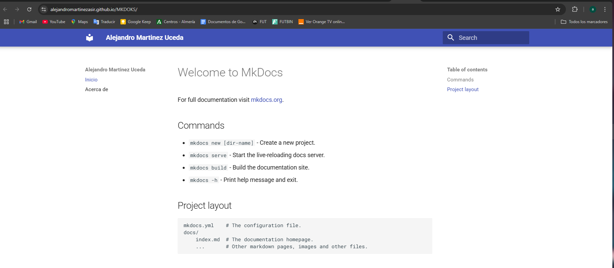
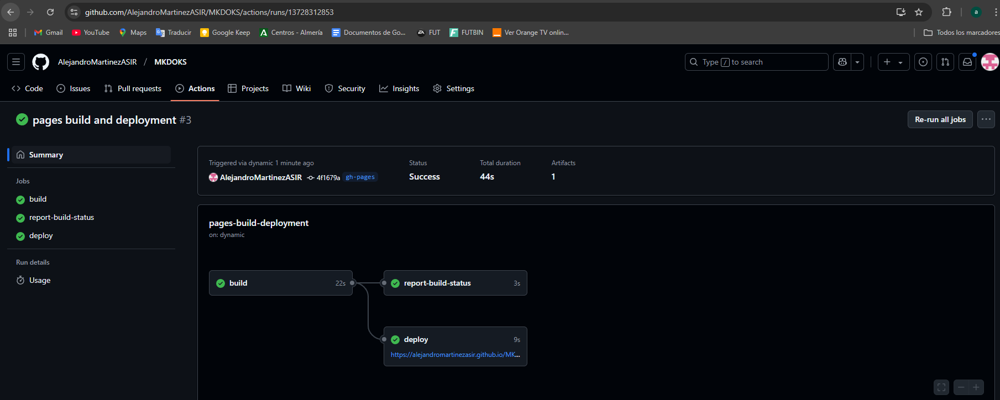

# Configuración de un sitio web estático con MkDocs y GitHub Pages

Este repositorio contiene un proyecto donde se utiliza **MkDocs** para generar un sitio web estático y **GitHub Actions** para automatizar el proceso de publicación en **GitHub Pages**.

## Pasos para configurar el sitio web y la publicación

### 1. Creamos el nuevo proyecto

~~~~
docker run --rm -it -p 8000:8000 -u $(id -u):$(id -g) -v "$PWD":/docs squidfunk/mkdocs-material new .
~~~~

Este comando genera un archivo de configuración mkdocs.yml y un directorio docs que contiene un archivo index.md.

### 2. Creacion de about.md
Todos los archivos de contenido deben estar en el directorio docs. Por ejemplo, puedes crear un archivo about.md
~~~~
touch docs/about.md
~~~~

### 3. Configuramos el archivo mkdocs.yml
~~~~
site_name: Alejandro Martinez Uceda
nav:
  - Inicio: index.md
  - Acerca de: about.md
theme:
  name: material
~~~~

### 4. Creacion del build
~~~~
1. mkdir -p .github/workflows

2. Creamos el token de usuario y lo introducimos en el repositorio nuestra variable en secrets y la llamareremos GIITHUB_TOKEN, ya que el secrets no te deja que comience por GITHUB.

3. nano .github/workflows/build-push-mkdocs.yaml
~~~~

### 5. Contenido del build
Hay que copiar las lines del repositorio del profesor pero hay que cambiar como he mencionado anteriormente el nombre del secrets en el env
~~~~
name: build-push-mkdocs

# Eventos que desescandenan el workflow
on:
  push:
    branches: ["main"]

  workflow_dispatch:

# A workflow run is made up of one or more jobs that can run sequentially or in parallel
jobs:

  # Job para crear la documentación de mkdocs
  build:
    # Indicamos que este job se ejecutará en una máquina virtual con la última versión de ubuntu
    runs-on: ubuntu-latest
    
    # Definimos los pasos de este job
    steps:
      - name: Clone repository
        uses: actions/checkout@v4

      - name: Install Python3
        uses: actions/setup-python@v4
        with:
          python-version: 3.x

      - name: Install Mkdocs
        run: |
          pip install mkdocs
          pip install mkdocs-material 

      - name: Build MkDocs
        run: |
          mkdocs build

      - name: Push the documentation in a branch
        uses: s0/git-publish-subdir-action@develop
        env:
          REPO: self
          BRANCH: gh-pages # The branch name where you want to push the assets
          FOLDER: site # The directory where your assets are generated
          GITHUB_TOKEN: ${{ secrets.GIITHUB_TOKEN }} # GitHub will automatically add this - you don't need to bother getting a token
          MESSAGE: "Build: ({sha}) {msg}" # The commit message
~~~~
### 6. Commit main
~~~~
git checkout --orphan gh-pages
git chechout main
git add .
git commit -m "Configuración inicial de MkDocs con GitHub Actions"
git push origin main
~~~~
### 7. Generamos el sitio web html
Instalamos mkdocsy el tema mkdocs-material
~~~~
apt install mkdocs
apt install mkdocs-material
~~~~
~~~~
git checkout gh-pages
git rm -rf .
mv site/* .
git add .
git commit -m "Publicación de MkDocs en GitHub Pages"
git push origin gh-pages --force
~~~~

# Comprobaciones

